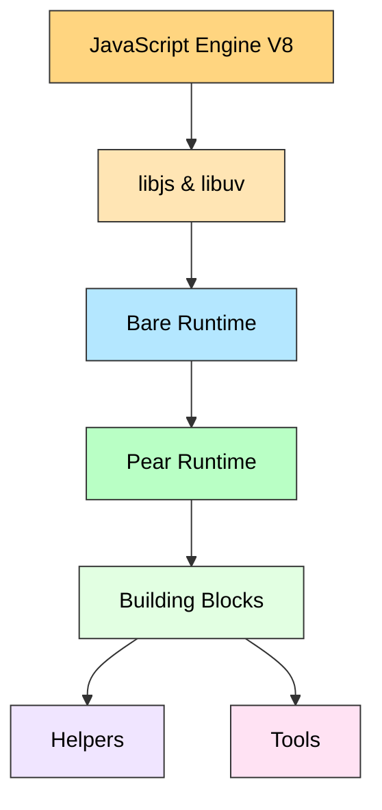

# Pear Architecture

The following sections will give you an overview of how [Pear](#pear-runtime) is built on top of [Bare](#bare-runtime) and the [building blocks](#building-blocks), [helpers](#helpers) and [tools](#tools) you can use to build serverless peer-to-pear applications.

## Bare Runtime

The [Pear Runtime](#pear-runtime) uses the [Bare](../references/bare/overview.mdx) JavaScript runtime, which is a small and modular JavaScript runtime for desktop and mobile. Bare is a small modular Javasript runtime for both mobile and desktop apps. Like Node.js, it provides an asynchronous, event-driven architecture for writing applications in the lingua franca of modern software. Unlike Node.js, it makes embedding and cross-device support core use cases, aiming to run just as well on your phone as on your laptop. The result is a runtime ideal for networked, peer-to-peer applications that can run on a wide selection of hardware.

Bare is built on top of [holepunchto/libjs](https://github.com/holepunchto/libjs), which provides low-level bindings to V8 in an engine independent manner, and [libuv/libuv](https://github.com/libuv/libuv), which provides an asynchronous I/O event loop. Bare itself only adds a few missing pieces on top to support a wider ecosystem of modules:

1. A module system supporting both CJS and ESM with bidirectional interoperability between the two.
2. A native addon system supporting both statically and dynamically linked addons.
3. Light-weight thread support with synchronous joins and shared array buffer support.

Everything else if left to userland modules to implement using these primitives, keeping the runtime itself succint and _bare_. By abstracting over both the underlying JavaScript engine using `libjs` and platform I/O operations using `libuv`, Bare allows module authors to implement native addons that can run on any JavaScript engine that implements the `libjs` ABI and any system that `libuv` supports.

:::info References

You can find implementation, usage and API details in the [Bare References](../references/bare/overview.mdx) section.

:::

## Pear Runtime

Though the Pear Runtime offers direct access to its base [API](../references/pear/api.md), in most cases you will start, publish and share your app through its [CLI](../references/pear/cli.md) and develop the app using its handy [building blocks](#building-blocks), [helpers](#helpers) and [tools](#tools).

:::info References

You can find implementation, usage and API details in the [Pear References](../references/pear/overview.mdx) section.

:::

## Building Blocks, Helpers and Tools

Though you can actually interact directly with the [Pear API](../references/pear/api.md), for most use cases, it'll be more convenient to use the [building blocks](#building-blocks). You can also find handy [helpers](#helpers) that simplify interacting with the building blocks, and [tools](#tools) designed to streamline app development.

### Building blocks

The essential building blocks for building powerful P2P applications using Pear.

| Name                                                            | Description                                                                                                                          | Stability  |
| --------------------------------------------------------------- | ------------------------------------------------------------------------------------------------------------------------------------ | ---------- |
| [Hypercore](https://docs.pears.com/building-blocks/hypercore)   | A distributed, secure append-only log for creating fast and scalable applications without a backend, as it is entirely P2P.          | **stable** |
| [Hyperbee](https://docs.pears.com/building-blocks/hyperbee)     | An append-only B-tree running on a Hypercore. Allows sorted iteration and more.                                                      | **stable** |
| [Hyperdrive](https://docs.pears.com/building-blocks/hyperdrive) | A secure, real-time distributed file system that simplifies P2P file sharing and provides an efficient way to store and access data. | **stable** |
| [Autobase](https://docs.pears.com/building-blocks/autobase)     | A "virtual Hypercore" layer over many Hypercores owned by many different peers.                                                      | **stable** |
| [Hyperdht](https://docs.pears.com/building-blocks/hyperdht)     | The Distributed Hash Table (DHT) powering Hyperswarm.                                                                                | **stable** |
| [Hyperswarm](https://docs.pears.com/building-blocks/hyperswarm) | A high-level API for finding and connecting to peers who are interested in a "topic".                                                | **stable** |

### Helpers

Helper modules can be used together with the building blocks to create cutting-edge P2P tools and applications.

| Name                                                                | Description                                                                                                                                                                  | Stability  |
| ------------------------------------------------------------------- | ---------------------------------------------------------------------------------------------------------------------------------------------------------------------------- | ---------- |
| [Corestore](https://docs.pears.com/helpers/corestore)               | A Hypercore factory designed to facilitate the management of sizable named Hypercore collections.                                                                            | **stable** |
| [Localdrive](https://docs.pears.com/helpers/localdrive)             | A file system interoperable with Hyperdrive.                                                                                                                                 | **stable** |
| [Mirrordrive](https://docs.pears.com/helpers/mirrordrive)           | Mirror a [Hyperdrive](https://docs.pears.com/building-blocks/hyperdrive) or a [Localdrive](https://docs.pears.com/helpers/localdrive) into another one.                      | **stable** |
| [Secretstream](https://docs.pears.com/helpers/secretstream)         | SecretStream is used to securely create connections between two peers in Hyperswarm.                                                                                         | **stable** |
| [Compact-encoding](https://docs.pears.com/helpers/compact-encoding) | A series of binary encoding schemes for building fast and small parsers and serializers. We use this in Keet to store chat messages and in Hypercore's replication protocol. | **stable** |
| [Protomux](https://docs.pears.com/helpers/protomux)                 | Multiplex multiple message oriented protocols over a stream.                                                                                                                 | **stable** |

### Tools

The following tools are used extensively employed in the day-to-day development and operation of applications built on Pear.

| Name                                                  | Description                                                                                                                                                       | Stability  |
| ----------------------------------------------------- | ----------------------------------------------------------------------------------------------------------------------------------------------------------------- | ---------- |
| [Hypershell](https://docs.pears.com/tools/hypershell) | A CLI to create and connect to P2P E2E encrypted shells.                                                                                                          | **stable** |
| [Hypertele](https://docs.pears.com/tools/hypertele)   | A swiss-knife proxy powered by [HyperDHT](https://docs.pears.com/building-blocks/hyperdht).                                                                       | **stable** |
| [Hyperbeam](https://docs.pears.com/tools/hyperbeam)   | A one-to-one and end-to-end encrypted internet pipe.                                                                                                              | **stable** |
| [Hyperssh](https://docs.pears.com/tools/hyperssh)     | A CLI to run SSH over the [HyperDHT](https://docs.pears.com/building-blocks/hyperdht).                                                                            | **stable** |
| [Drives](https://docs.pears.com/tools/drives)         | CLI to download, seed, and mirror a [Hyperdrive](https://docs.pears.com/building-blocks/hyperdrive) or a [Localdrive](https://docs.pears.com/helpers/localdrive). | **stable** |
