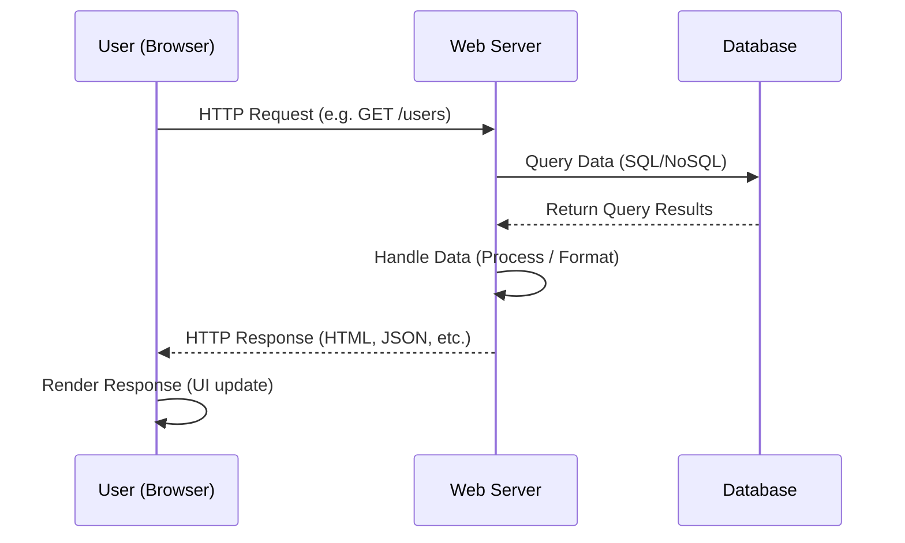
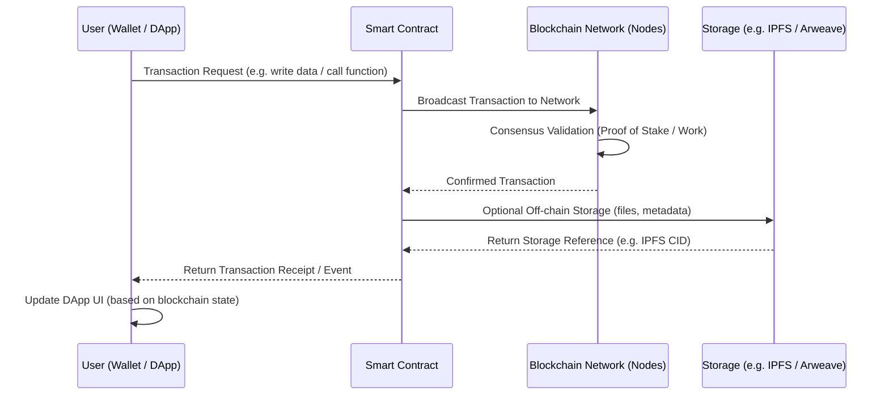
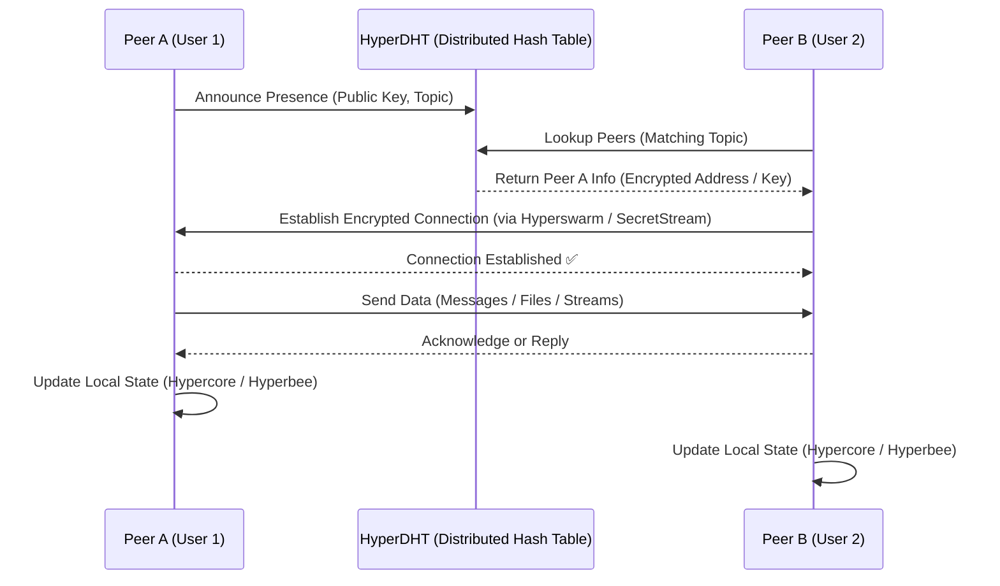

# What is Pear?

**Pear by Holepunch**  brings a revolutionary approach to app development by utilizing Peer-to-Peer (P2P) technology. It provides a comprehensive solution that enables developers to build, share applications across desktop, terminal, and mobile platforms, all without the need for centralized infrastructure.

With Pear, developers can break free from traditional infrastructure constraints, creating unstoppable applications that are cost-efficient and accessible to everyone.

## The Internet of Peers

Pear is unique as it allows for direct peer-to-peer applications. It completely removes most financial infrastructural barriers related to web2 and web3 applications.

## What Makes Pear Unique

Pear removes the need for traditional infrastructure and allows you to focus on creating innovative solutions that are fast, scalable, and highly effective.

### P2P Runtime

Pear allows you to create, deploy and run secure peer to peer applications without the need of nay third parties.

### Infrastructure-Free

No need for centralized servers, reducing costs and complexity.

### Scalability

As apps run are free of traditional infrastructure, you effortlessly scale applications without the usual bottlenecks associated with web2 and web3.

### Open-Source

Join the P2P revolution and [contribute](contribute-to-pear.md) to an open and decentralized future.

## Web2 vs Web3 vs Pear

## Web2

In web2 application a user sends a request to a server. The server in turn queries database() for data. Once the DB return the data, the server processes it and responds to the client with the results.

Traditional web2 applications rely heavily on centralized servers and infrastructure. This dependency leads to increased costs, single points of failure, and scalability limitations.

## Web3

In web3 decentralized applications(dApps), the user makes a request through their wallet. The dApp then sends the transaction to a Smart Contract(SC), which in turn broadcasts it to the blockchain network and awaits confirmation through the node's consensus. After this, the transaction result is recorded on-chain and the dApp updates the user interface.

Web3 is the next step in decentralization, it replaces centralized servers with a network of distributed decentralized nodes for computation. However, this is not without drawbacks:

### Network Nodes and Consensus

Network nodes usually require substantial computational power to reach a consensus. This means that though it is decentralized, it is not accessible to anyone and also adds huge infrastructure dependencies, the cost of which is usually transferred to developers and users alike through fees.

### Bottlenecks

As all transaction need to be run and validated by two thirds of validators, bottlenecks are a day-to-day problem in web3 dApps.

### Restrictive Technology

Though smart contract have added functionality to web3, the technology is scalability and performance are still major challenges for many Web3 apps.

## Pear

In Pear’s peer-to-peer model, each peer announces itself and discovers others through the [HyperDHT](../about-pear/architecture/building-blocks.md#hyperdht), using a shared topic or public key. Once discovered, peers establish encrypted connections using [Hyperswarm](../about-pear/architecture/building-blocks.md#hyperswarm) and [SecretStream](../about-pear/architecture/helpers.md#secretstream), enabling them to communicate directly without intermediaries. 

Data flows between peers in real time, and each peer maintains its own local state through [Hypercore](../about-pear/architecture/building-blocks.md#hypercore) or [Hyperbee](../about-pear/architecture/building-blocks.md#hyperbee), ensuring persistence and synchronization. This architecture eliminates the need for centralized servers or blockchains—applications run entirely at the network’s edge, powered by the connected peers themselves.

Pear is truly decentralized. Every peer can act as both a client and a server, ensuring apps are scalable, secure, and can grow globally without relying on centralized services.

Pear is based on [Bare](architecture.md#bare), small and modular JavaScript runtime for desktop and mobile, that allows seamless integration on both desktop and mobile.
